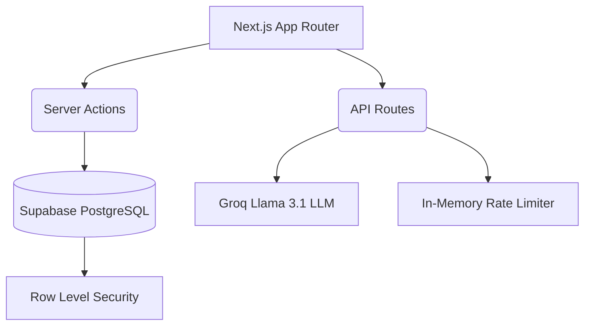

# Automated SLA Risk Pipeline (ASRP): Enterprise Vendor Risk & SLA Intelligence Platform

[](https://asrp.sejabur.dev)
[](#license)

**Live Application:** [asrp.sejabur.dev](https://asrp.sejabur.dev)

---

## Summary

The Automated SLA Risk Pipeline (ASRP) is an enterprise tool built to solve a critical blind spot in IT management: tracking third-party vendor reliability. By automating the comparison between promised Service Level Agreements (SLAs) and actual uptime, the platform replaces manual spreadsheets with real-time, data-driven intelligence. It enables organizations to instantly calculate vendor risk, generate executive-level briefings, and help organizations identify elevated operational risk before vendor reliability issues propagate across dependent services.

## Problem Statement

Organizations rely on dozens of cloud infrastructure and Software-as-a-Service (SaaS) providers to maintain their daily operations. Each of these vendors provides an SLA guaranteeing a specific percentage of uptime (e.g., 99.9%). 

When a vendor fails to meet their SLA, it can lead to cascading operational failures and financial loss. However, tracking actual uptime against promised SLA metrics across multiple vendors is often a manual, fragmented process. This leads to missed compliance audits, failure to claim SLA credit penalties, and an inability to accurately assess long-term vendor reliability.

## Why This Product?

Vendor risk management is frequently treated as a reactive discipline—often ignored until a catastrophic outage occurs. The goal was to bridge the gap between technical infrastructure monitoring and executive business decision-making. 

By building a tool that mathematically quantifies SLA misses and instantly translates them into plain-English AI reports, this product transforms raw uptime data into actionable governance, empowering teams to hold vendors accountable, enforce compliance, and proactively maintain resilient systems.

## Target Audience

This application is designed for:
- **Technical Product Managers (TPMs) & IT Managers** who need a centralized dashboard to track vendor performance.
- **Compliance and Security Officers** conducting vendor risk assessments.
- **Site Reliability Engineering (SRE) Teams** tracking third-party dependency uptime.

## Success Metrics

The platform was designed around measurable operational objectives:
- Reduce manual vendor risk assessment effort.
- Improve visibility into SLA compliance.
- Standardize vendor risk scoring across services.
- Generate executive-ready summaries with minimal analyst effort.
- Simplify audit preparation through centralized reporting.

## Key Product Decisions

Developing this platform required strict product judgment to prioritize actionable intelligence over vanity features:

1. **Proportional Risk Scoring Over Binary States** 
   Instead of a simple "pass/fail" for SLA breaches, the platform utilizes a proportional risk scoring algorithm that scales risk according to SLA deviation. Missing a 99.9% SLA by 0.1% versus 1.5% demands fundamentally different operational responses. The 1-10 scoring system reflects this reality.
2. **Constrained AI Integration** 
   Rather than implementing an open-ended AI chatbot, the Large Language Model (Llama 3.1) is strictly constrained via prompt engineering. The AI acts exclusively as an executive analyst, generating factual briefs strictly from provided database metrics to significantly reduce the likelihood of hallucinated outputs by constraining the model to structured operational data.
3. **Client-Side Document Rendering** 
   PDF dossiers are generated entirely within the client browser rather than a backend service. This ensures that sensitive, internal vendor risk profiles are never transmitted to third-party rendering APIs.

## Core Functionalities

### 1. Programmatic Risk Calculation
ASRP utilizes a strict mathematical model. The system calculates a proportional risk score (1-10) by comparing the vendor's promised SLA against their actual delivered SLA. 

### 2. Automated AI Reporting
The application integrates with the Groq inference engine to synthesize raw vendor metrics into clear, plain-text analyses. 

### 3. PDF Dossier Generation
Users can instantly export the entire ecosystem's data into a professionally formatted PDF document for immediate executive review.

### 4. Role-Based Access Control (RBAC)
The application enforces strict data governance through Supabase Row Level Security (RLS) ensuring Operators can only edit their own records, while Administrators possess global visibility.

## System Architecture



## Technology Stack

**Frontend**
- Next.js 15
- React
- Tailwind CSS

**Backend**
- Server Actions
- API Routes

**Database**
- Supabase PostgreSQL

**Authentication**
- Supabase Auth

**AI**
- Groq
- Llama 3.1

**Deployment**
- Vercel

## Future Roadmap

- Predictive SLA breach forecasting
- Historical vendor trend analytics
- Service dependency graph visualization
- Multi-tenant enterprise deployment
- Integration with ServiceNow and Jira Service Management

## Design Philosophy

The architectural and UI design philosophy of ASRP is minimalist, data-first, and highly actionable. The interface was deliberately designed to reduce cognitive load, prioritizing immediate visibility into high-risk vendors and pending security audits over complex, unnecessary charts. Every feature, from the automated AI briefs to the color-coded risk badges, serves the singular product objective: faster, more accurate vendor governance.

## Security Overview

This application includes standard security measures designed to protect the integrity of the data and prevent abuse:
- **Rate Limiting:** API endpoints are protected by an in-memory rate limiter to prevent denial-of-service attempts.
- **Input Validation:** Server actions strictly validate numerical boundaries and string lengths before database insertion.
- **HTTP Security Headers:** Implemented via Next.js configuration to mitigate Cross-Site Scripting (XSS) and Clickjacking.

## Local Setup and Installation

### Prerequisites
- Node.js (v18 or higher)
- A Supabase Account
- A Groq API Key

### Step 1: Clone the Repository
```bash
git clone https://github.com/Sejabur/Automated-SLA-Risk-Pipeline.git
cd Automated-SLA-Risk-Pipeline
```

### Step 2: Install Dependencies
```bash
npm install
```

### Step 3: Database Configuration
1. Create a new project in Supabase.
2. Navigate to the SQL Editor in your Supabase dashboard.
3. Copy the contents of `supabase_schema.sql` from this repository and execute it to generate the necessary tables and Row Level Security policies.

### Step 4: Environment Variables
Create a file named `.env.local` in the root directory and add the following variables:
```env
NEXT_PUBLIC_SUPABASE_URL=your_supabase_project_url
NEXT_PUBLIC_SUPABASE_ANON_KEY=your_supabase_anon_key
GROQ_API_KEY=your_groq_api_key
```

### Step 5: Start the Server
```bash
npm run dev
```

## Notice of Liability

This application is provided "AS IS" and was developed to programmatically manage and calculate vendor SLA risk. While the codebase implements standard security measures, it is not actively maintained. Organizations utilizing this open-source software must conduct their own security audits before deploying it in environments handling sensitive data. The author is not liable for any direct or indirect damages, data loss, or breaches resulting from the use of this software.

## License

This project is licensed under the MIT License. See the LICENSE file for details.
