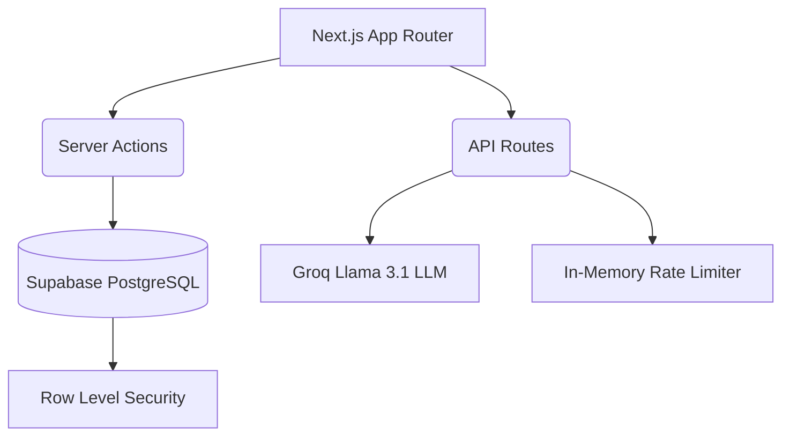

# Automated SLA Risk Pipeline (ASRP)

[](https://asrp.sejabur.dev)
[](#license)

**Live Application:** [asrp.sejabur.dev](https://asrp.sejabur.dev)

---

## Introduction

The Automated SLA Risk Pipeline (ASRP) is an open-source application designed to track, evaluate, and mitigate risks associated with third-party vendor Service Level Agreements (SLAs). It provides a programmatic framework for monitoring operational uptime and generating automated intelligence reports on vendor reliability.

## Problem Statement

Organizations rely on dozens of cloud infrastructure and Software-as-a-Service (SaaS) providers to maintain their daily operations. Each of these vendors provides an SLA guaranteeing a specific percentage of uptime (e.g., 99.9%). 

When a vendor fails to meet their SLA, it can lead to cascading operational failures and financial loss. However, tracking actual uptime against promised SLA metrics across multiple vendors is often a manual, fragmented process managed in spreadsheets. This leads to missed compliance audits, failure to claim SLA credit penalties, and an inability to accurately assess long-term vendor reliability.

## Target Audience

This application is designed for:
- **IT Managers** who need a centralized dashboard to track vendor performance.
- **Compliance and Security Officers** conducting vendor risk assessments.
- **Site Reliability Engineering (SRE) Teams** tracking third-party dependency uptime.

## Core Functionalities

### 1. Programmatic Risk Calculation
ASRP moves away from arbitrary risk assessments by utilizing a strict mathematical model. The system calculates a proportional risk score (1-10) by comparing the vendor's promised SLA against their actual delivered SLA. Missing a promised SLA by even a fraction of a percent linearly increases the operational risk score.

### 2. Automated AI Reporting
The application integrates with the Groq inference engine (Llama 3.1) to synthesize raw vendor metrics into clear, plain-text analyses. The AI operates under strict systemic guardrails to evaluate data purely based on uptime metrics, preventing hallucinations regarding external factors.

### 3. PDF Dossier Generation
Users can instantly export the entire ecosystem's data into a formatted PDF document. This feature is built entirely on the client-side to ensure sensitive vendor data is not transmitted to external rendering services.

### 4. Role-Based Access Control (RBAC)
The application enforces strict data governance through Supabase Row Level Security (RLS). 
- **Operators:** Can add, edit, and manage their own vendor records.
- **Administrators:** Possess global visibility and modification rights across the entire organization.

## Architecture



- **Frontend:** Next.js 15 (React), TailwindCSS.
- **Database & Authentication:** Supabase (PostgreSQL).
- **Inference Engine:** Groq SDK.

## Local Setup and Installation

To run this application locally on your machine, follow these instructions.

### Prerequisites
- Node.js (v18 or higher)
- npm or yarn
- A Supabase Account
- A Groq API Key

### Step 1: Clone the Repository
```bash
git clone https://github.com/Sejabur/Automated-SLA-Risk-Pipeline.git
cd Automated-SLA-Risk-Pipeline
```

### Step 2: Install Dependencies
```bash
npm install
```

### Step 3: Database Configuration
1. Create a new project in Supabase.
2. Navigate to the SQL Editor in your Supabase dashboard.
3. Copy the contents of `supabase_schema.sql` from this repository and execute it to generate the necessary tables and Row Level Security policies.

### Step 4: Environment Variables
Create a file named `.env.local` in the root directory of the project and add the following variables:

```env
NEXT_PUBLIC_SUPABASE_URL=your_supabase_project_url
NEXT_PUBLIC_SUPABASE_ANON_KEY=your_supabase_anon_key
GROQ_API_KEY=your_groq_api_key
```

### Step 5: Start the Development Server
```bash
npm run dev
```
Navigate to `http://localhost:3000` in your browser.

## Security Overview

This application includes standard security measures designed to protect the integrity of the data and prevent abuse:
- **Rate Limiting:** API endpoints are protected by an in-memory rate limiter to prevent denial-of-service attempts.
- **Input Validation:** Server actions strictly validate numerical boundaries and string lengths before database insertion.
- **HTTP Security Headers:** Implemented via Next.js configuration to mitigate Cross-Site Scripting (XSS) and Clickjacking.

## Notice of Liability

This application is provided "AS IS" and was developed to programmatically manage and calculate vendor SLA risk. While the codebase implements standard security measures, it is not actively maintained. Organizations utilizing this open-source software must conduct their own security audits before deploying it in environments handling sensitive data. The author is not liable for any direct or indirect damages, data loss, or breaches resulting from the use of this software.

## License

This project is licensed under the MIT License. See the LICENSE file for details.
